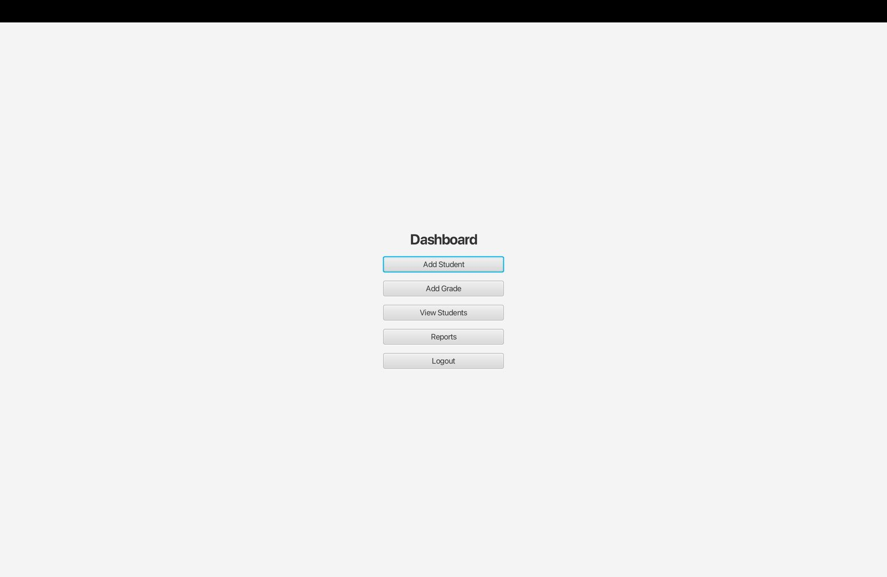
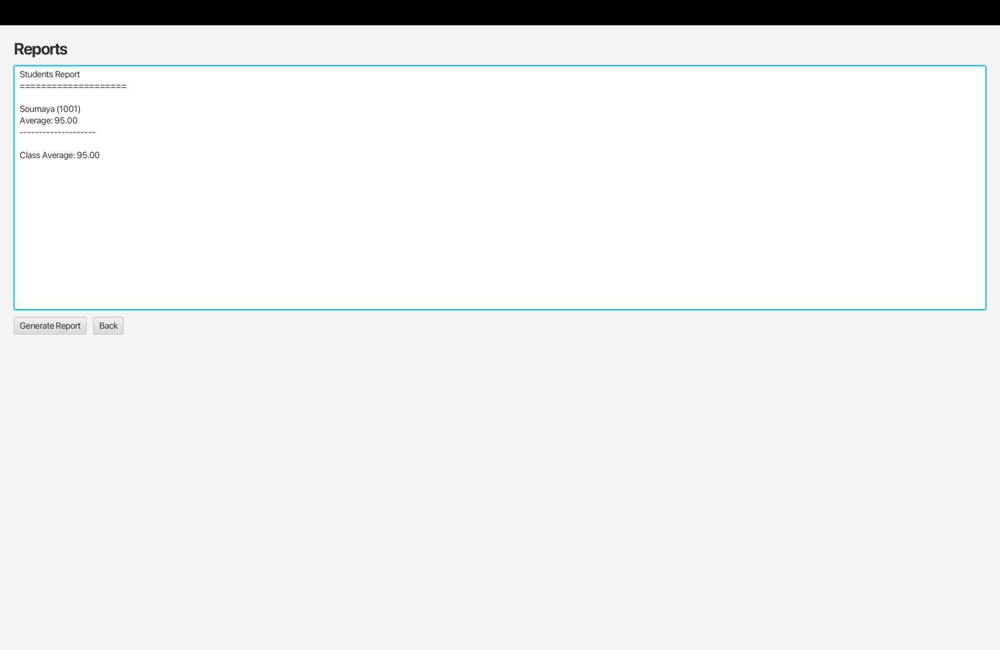

# Student Grades Management System

A JavaFX-based student grades management system built with Java and Maven.

## How to Run in NetBeans

1. Open the project folder `StudentGradesManagementSystem`.
2. Right-click the project name.
3. Select **Run Maven > Other Goals...**
4. Enter `javafx:run`.
5. Click **OK**.

## Login Information

- **Username:** admin
- **Password:** 1234

## Data Files

The application uses the following data files:

- `data/students.txt`
- `data/grades.txt`
## Screenshots

### Dashboard

### Add Student

### Add Grade

### View Students

### Reports

